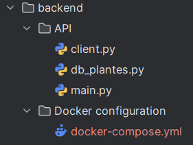
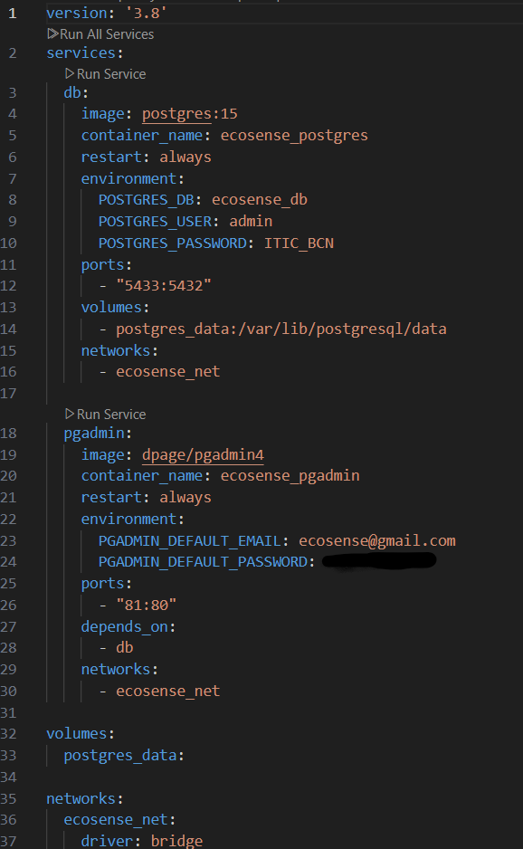
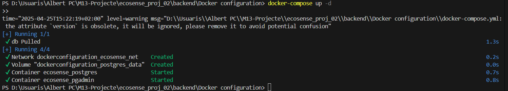
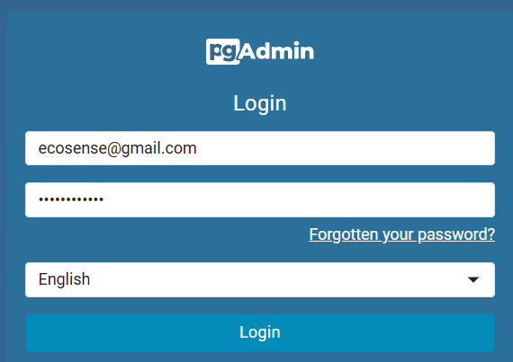
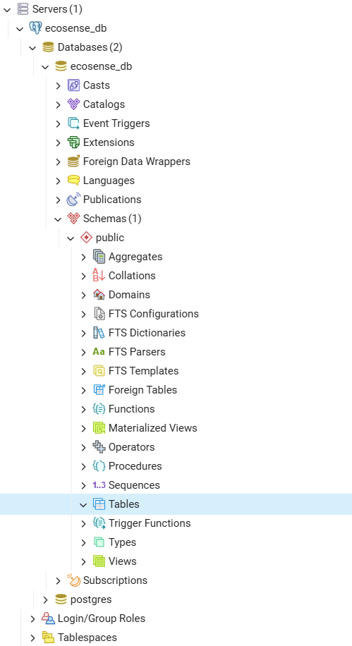
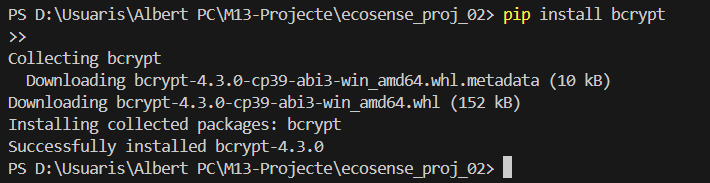

# ECOSENSE
## Documentació backend i frontend 
### Realitzat per: Albert Penadés Casajús
### DAW |  Curs: 2024-25 

## BACKEND
####  Distribució del projecte (inicialment):

- blablablabla

#### Composició de l'API:
blablablabla

#### Fitxer docker (configuració):
blablablabla

#### Aixecar container (inici):
Comanda per arrancar el contenidor docker:

#### Inici pgAdmin 4 (login):

#### Inici del projecte (inicialment les taules es troben buides):

## Encriptació de contrassenyes - bycrypt 
Primer de tot instalar-lo:

## FRONTEND